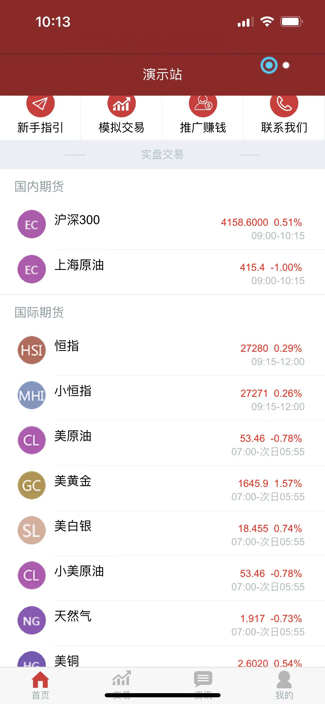
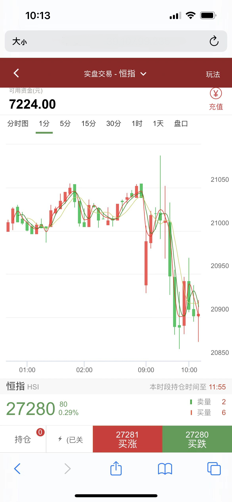
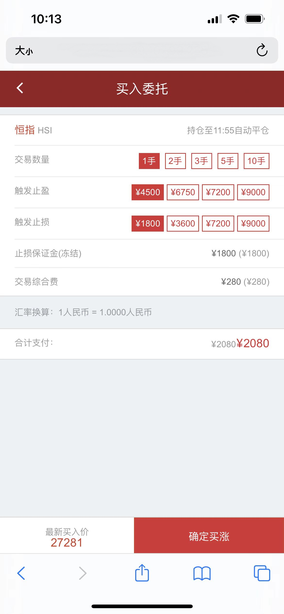
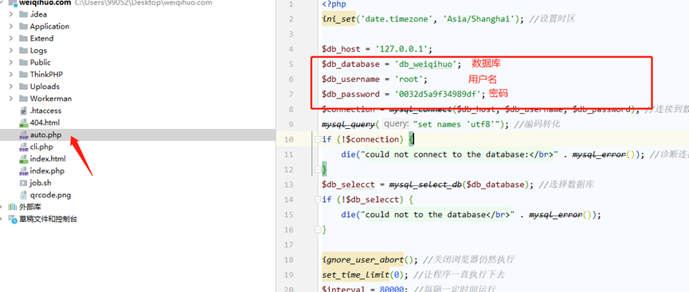

# 恒指、黄金期货，国内， 国际期货，交易系统源码

**环境要求：**

> Php5.6  mysql5.7 nginx redis memcahed
>
> 项目数据库配置信息在 Application/Common/config.php中
>
> 系统设有4个后台，分别为：总后台 -> 运营分部 -> 运营中心 -> 代理
> 
> 每个运营中心需要配置单独的二级域名，比如主域名为 test.com、二级域名为a.test.com、b.test.com等。在域名服务商处，将域名设置为泛解析，解析到服务器ip即可，nginx设置为 *.test.com
> 
> 运营商二级域名支持后台配置，在总后台运营中心管理模块，配置即可
>
> 登录账户： 后台地址：http://域名/admin
> 
> 总后台账户：admin/123456
>
> 运营分部：tebieyunying/123456
> 
> 运营中心：yunyingzhongxin/123456
> 
> 代理商：jingjiren/123456
>
> 手机端普通用户账户：123456/123456

## 以下共3个地方需要启动相关计划脚本

> **数据源使用地址（备注）：http://39.107.99.235:1008/market/market.php**
>
> 行情接收启动命令： 启动前请确定ip已授权，行情对接完成
>
> 启动前需要修改：Events.php 将数据库信息改为自己的
> 
>
> 启动命令： /www/server/php/56/bin/php
> /www/wwwroot/www.28hxyct.xyz/Workerman/GatewayWorker/start.php restart
> –d
>
> 目录：www.28hxyct.xyz 换成你的项目实际目录
>
> 命令启动完毕之后，修改对应的html、将连接的websocket地址改成你自己的服务器， 如果域名为https，前缀需要使用wss
> 并在nginx配置代理即可
>
> 例如：
> 

## 宝塔计划任务：

> 1：每隔5分钟定时更新休市状态 	脚本内容：
>     sh /www/wwwroot/www.28hxyct.xyz/job.sh 	www.28hxyct.xyz 换成你的项目实际目录 	job.sh在你的项目根目录下，如果需要更换新的项目需要进入修改该文件。
>     命令如下：
>
> 
>
> 2：每隔30分钟定时重载行情（这个最小30分钟，时间不要小于30分钟）
> 	脚本内容：/www/server/php/56/bin/php
> /www/wwwroot/www.28hxyct.xyz/Workerman/GatewayWorkerNew/start.php reload –d  www.28hxyct.xyz 换成你的项目实际目录
> 

## 宝塔Supervisor管理器

> 自动平仓脚本：/www/server/php/56/bin/php auto.php
> 
> auto.php在你的项目根目录下，需要更改文件的数据库连接信息
> 
> > 
>
> 
> 
> 
> **添加计划步骤如下：**
> 

